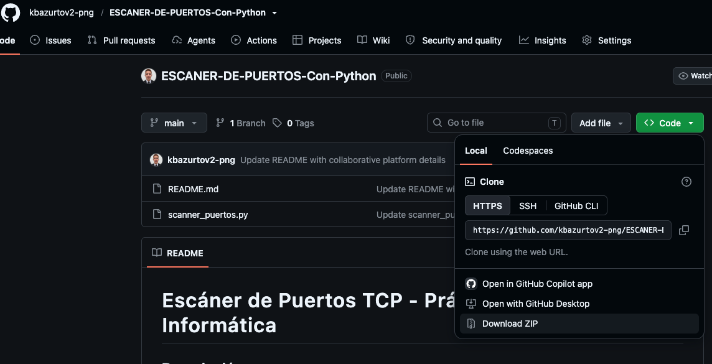
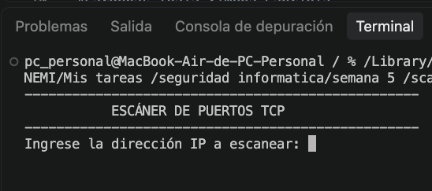
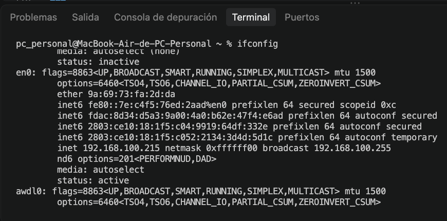
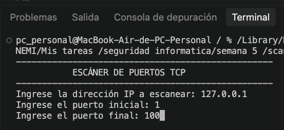
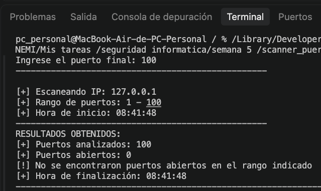

# Manual de Uso — Escáner de Puertos TCP

**Universidad Estatal de Milagro (UNEMI) — Grupo #10**

**Integrantes:**
- Añasco Espinoza Darío Franco
- Arias Escobar Genaro Israel
- Bazurto Velez Kevin Ariel
- Castro Escobar Milly Crisol
- Cobo Ordoñez José Rodolfo
- Cárdenas Toala Ximena Gabriela
- Guamán Vasconez Rolando Alexander

Este manual explica cómo instalar y utilizar el programa de consola que
verifica qué puertos TCP están abiertos en un equipo, dentro de un rango
definido por el usuario.

---

## Índice

1. [Requisitos](#1-requisitos)
2. [Instalación](#2-instalación)
3. [Cómo iniciar la aplicación](#3-cómo-iniciar-la-aplicación)
4. [Cómo ingresar la IP](#4-cómo-ingresar-la-ip)
5. [Cómo seleccionar el rango de puertos](#5-cómo-seleccionar-el-rango-de-puertos)
6. [Cómo ejecutar el escaneo](#6-cómo-ejecutar-el-escaneo)
7. [Cómo interpretar los resultados](#7-cómo-interpretar-los-resultados)
8. [Errores comunes al ingresar datos](#8-errores-comunes-al-ingresar-datos)
9. [Solución de problemas](#9-solución-de-problemas)
10. [Advertencia legal](#10-advertencia-legal)

---

## 1. Requisitos

| Requisito | Detalle |
|---|---|
| Computador | Windows, Linux o macOS |
| Python | Versión 3.6 o superior |
| Editor de código | Visual Studio Code (recomendado) |
| Bibliotecas | Ninguna externa: `socket` y `datetime` vienen incluidas en Python |

Para comprobar si Python está instalado, abra una terminal y escriba:

```bash
python --version
```

Si responde con algo como `Python 3.12.1`, ya puede continuar. Si aparece un
error, descargue Python desde <https://www.python.org/downloads/> y, en
Windows, marque la casilla **Add Python to PATH** durante la instalación.

---

## 2. Instalación

El programa es un único archivo (`escaner_puertos.py`), por lo que no
requiere instalación formal.

**Opción A — Clonar el repositorio:**

```bash
git clone https://github.com/kbazurtov2-png/ESCANER-DE-PUERTOS-Con-Python
cd ESCANER-DE-PUERTOS-Con-Python
```

**Opción B — Descarga manual:**

1. Ingrese al repositorio en GitHub.
2. Presione el botón verde **Code** y elija **Download ZIP**.
3. Descomprima la carpeta.
4. Ábrala con Visual Studio Code (**Archivo → Abrir carpeta**).



---

## 3. Cómo iniciar la aplicación

1. Abra una terminal dentro de la carpeta del proyecto (en VS Code:
   **Terminal → Nueva terminal**).
2. Ejecute:

```bash
python escaner_puertos.py
```

En Linux o macOS use `python3 escaner_puertos.py`.

Al iniciar aparece el encabezado del programa y de inmediato se solicita la
IP:



---

## 4. Cómo ingresar la IP

Escriba la dirección del equipo a analizar y presione Enter:

| Valor | Significado |
|---|---|
| `127.0.0.1` | El propio computador |
| `192.168.1.10` | Otro equipo dentro de la misma red local |

**¿Cómo conocer la IP del equipo?**

- Windows: ejecute `ipconfig` y revise *Dirección IPv4*.
- Linux o macOS: ejecute `ip a` o `ifconfig`.



Para escanear otro equipo de la red personal, ambos dispositivos deben estar
conectados a la misma red (por ejemplo, el mismo Wi-Fi).

---

## 5. Cómo seleccionar el rango de puertos

El programa solicita dos valores, uno a continuación del otro:



**Advertencia importante:**

- Si se escribe una letra o un texto en lugar de un número, el programa se
  detiene de inmediato con un error de Python (`ValueError`).

Por eso, al usar el programa, se recomienda ingresar siempre números
enteros válidos, con el puerto inicial menor o igual al final.

Rangos sugeridos para las pruebas:

| Rango | Descripción |
|---|---|
| 1 – 100 | Prueba rápida, ideal para la demostración en clase |
| 1 – 1024 | Puertos conocidos (HTTP, FTP, SSH, etc.) |

---

## 6. Cómo ejecutar el escaneo

El escaneo inicia automáticamente después de ingresar el puerto final. El
programa primero muestra un encabezado con los datos de la prueba:



A partir de ahí, imprime una línea únicamente cuando encuentra un puerto
abierto:

```
Puerto 22 - ABIERTO
Puerto 80 - ABIERTO
```

**Detalle técnico importante:**
El programa no tiene una opción para cancelar el escaneo a mitad de camino de
forma controlada: presionar **Ctrl + C** lo interrumpe, pero no se mostrará
el resumen final, solo un mensaje de error de Python en la terminal.

---

## 7. Cómo interpretar los resultados

Al terminar de recorrer todo el rango, se muestra el resumen:

```
RESULTADOS OBTENIDOS:
[+] Puertos analizados: 100
[+] Puertos abiertos: 2
[+] Lista de puertos abiertos: [22, 80]
[+] Hora de finalización: 13:25:04
----------------------------------------------------------------------------------------------------
```

| Campo | Significado |
|---|---|
| **Puertos analizados** | Total de puertos revisados en el rango indicado |
| **Puertos abiertos** | Cantidad de puertos que respondieron como accesibles |
| **Lista de puertos abiertos** | Números exactos de los puertos abiertos encontrados |
| **Hora de inicio / finalización** | Permiten calcular cuánto tardó el escaneo completo |

Si no se encuentra ningún puerto abierto, el programa lo indica así:

```
[!] No se encontraron puertos abiertos en el rango indicado
```

Es un resultado válido: significa que, en ese rango, el equipo no tiene
servicios escuchando o un firewall bloqueó las conexiones.

**El programa no identifica el servicio.**
Para interpretar qué es cada puerto, puede usarse esta tabla de referencia:

| Puerto | Servicio habitual |
|---|---|
| 21 | FTP |
| 22 | SSH |
| 23 | Telnet |
| 25 | SMTP (correo) |
| 53 | DNS |
| 80 | HTTP (páginas web) |
| 443 | HTTPS |
| 3306 | MySQL |
| 3389 | Escritorio remoto (RDP) |
| 8080 | HTTP alternativo, común en servidores de prueba |

---

## 8. Errores comunes al ingresar datos

Como el programa no valida los datos, estos son los errores que puede
mostrar Python directamente si algo se escribe mal:

| Situación | Lo que ocurre | Solución |
|---|---|---|
| Se escribe texto en vez de un número en "puerto inicial" o "final" | El programa se cierra mostrando `ValueError: invalid literal for int()` | Vuelva a ejecutar el programa e ingrese solo números enteros |
| El puerto final es menor que el inicial | El escaneo no recorre ningún puerto; el resumen muestra 0 analizados | Verifique que "Desde" sea menor o igual que "Hasta" |
| Se ingresa un número mayor a 65535 | El programa intenta escanear igual y puede fallar o tardar de más | Use valores entre 1 y 65535 |
| Se deja algún campo vacío | El programa se cierra con error al no poder convertir el texto vacío en número | Ingrese un valor en cada campo antes de presionar Enter |

---

## 9. Solución de problemas

| Problema | Causa probable | Solución |
|---|---|---|
| `python: command not found` | Python no instalado o fuera del PATH | Reinstale marcando *Add Python to PATH*; pruebe con `python3` |
| El programa se cierra con un error en rojo | Se ingresó texto donde se esperaba un número | Revise la sección 8 y vuelva a intentarlo |
| El escaneo parece "colgado" | Rango muy amplio (por ejemplo, más de 10 000 puertos) | Espere; el programa no usa hilos, así que revisa un puerto a la vez |

**Para generar un puerto abierto de prueba** en el propio equipo, abra una
segunda terminal y ejecute:

```bash
python -m http.server 8080
```

Deje esa terminal abierta y, en la terminal del escáner, analice `127.0.0.1`
en el rango 8000–8100. El puerto 8080 debería aparecer como `ABIERTO`.

---

## 10. Advertencia legal

El escaneo de puertos sobre equipos o redes ajenas, sin autorización del
propietario, puede constituir una infracción legal en Ecuador y en la
mayoría de países. Este programa se entrega con fines estrictamente
académicos.

Realice las pruebas únicamente sobre el propio equipo o sobre otros equipos
de la red personal, con conocimiento de las personas involucradas.